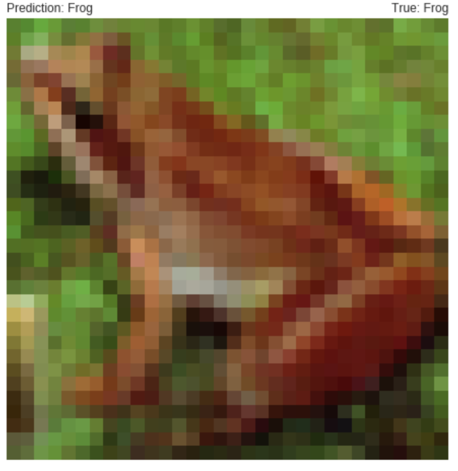
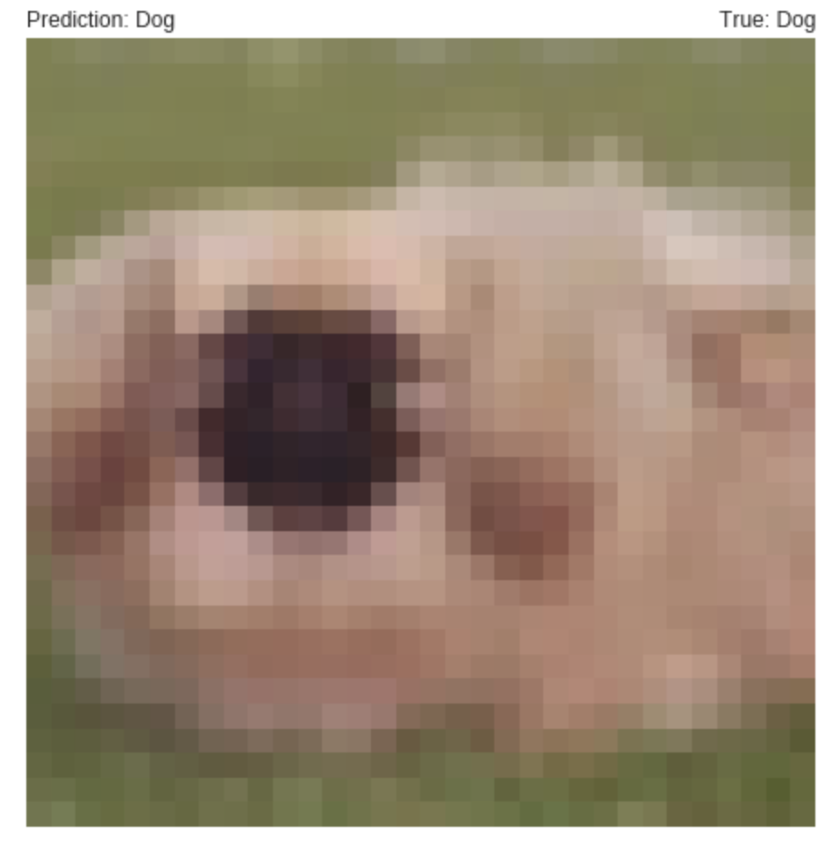
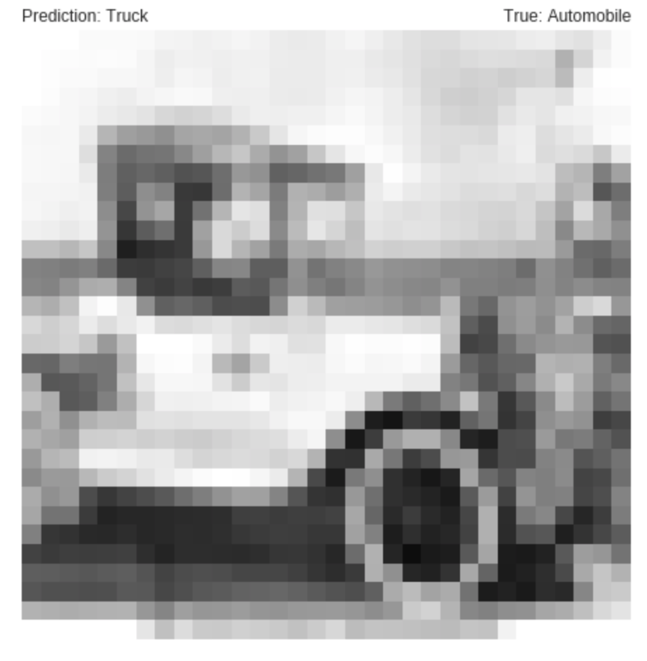

# Project-cifar10

#About the dataset - The CIFAR-10 dataset consists of 60000 32x32 colour images in 10 classes, with 6000 images per class. There are 50000 training images and 10000 test images.

Implemented Cifar10 Image Classification Using CNN and batchNormalization on the data.

1. Achieved Training accuracy of 93.8% and Testing accuracy of 84.48% [[cifar10_cnn]](https://github.com/anurag2996/Project-cifar10/blob/master/cifar10_cnn.ipynb)

2. Achieved Training accuracy of 96.34% and Testing accuracy of 85.75% [[cifar10_keras]](https://github.com/anurag2996/Project-cifar10/blob/master/cifar10_keras_2.ipynb)

## Convolutional neural networks
In deep learning, a convolutional neural network (CNN, or ConvNet) is a class of deep neural networks, most commonly applied to analyzing visual imagery.

CNNs use a variation of multilayer perceptrons designed to require minimal preprocessing. They are also known as shift invariant or space invariant artificial neural networks (SIANN), based on their shared-weights architecture and translation invariance characteristics.

Convolutional networks were inspired by biological processes in that the connectivity pattern between neurons resembles the organization of the animal visual cortex. Individual cortical neurons respond to stimuli only in a restricted region of the visual field known as the receptive field. The receptive fields of different neurons partially overlap such that they cover the entire visual field.

CNNs use relatively little pre-processing compared to other image classification algorithms. This means that the network learns the filters that in traditional algorithms were hand-engineered. This independence from prior knowledge and human effort in feature design is a major advantage.

## Output
### Correct Predictions

### Incorrect Prediction

